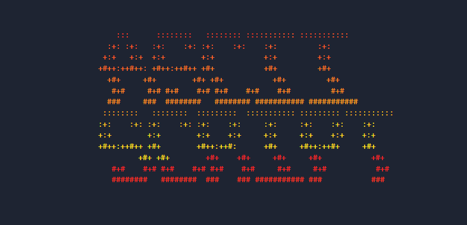

# ASCII-SCRIPT

> Micro-librería JavaScript para renderizado y animación de arte ASCII en el DOM

[](https://www.npmjs.com/package/@jyiro/ascii-script)
[](https://opensource.org/licenses/MIT)
[](https://bundlephobia.com)



**[English](#english-version) | Español**

**🎮 [Demo Interactivo](https://asciiscript.vercel.app)** | **📦 [NPM](https://www.npmjs.com/package/@jyiro/ascii-script)** | **📖 [Documentación](./docs/api.md)**

Librería ligera e independiente de frameworks para crear impresionantes animaciones de arte ASCII en el navegador.

## Características

- **Efectos Variados** - Wave, color-cycle, glitch, scramble, typewriter, matrix rain y más
- **Presets Listos** - Combinaciones preconfiguradas de efectos (hologram, rainbow, terminal, decrypt)
- **Bundle Minúsculo** - ~5kb core + efectos cargados bajo demanda (3-5kb cada uno)
- **Rendimiento 60fps** - Aceleración GPU vía `will-change` + canvas opaco, pausa automática en pestañas ocultas y elementos fuera del viewport
- **Agnóstico de Framework** - JavaScript puro, funciona con React, Vue, Svelte o vanilla
- **Auto-Detección** - Detecta y formatea automáticamente arte ASCII multi-línea
- **Extensible** - Sistema de plugins para efectos personalizados
- **API Intuitiva** - Métodos encadenables y configuración sencilla
- **Responsive** - Se adapta a diferentes tamaños de pantalla
- **Zero Dependencies** - Sin dependencias externas

## Inicio Rápido

### Instalación

```bash
npm install @jyiro/ascii-script
```

O usando CDN:

```html
<script type="module">
  import { create } from 'https://unpkg.com/@jyiro/ascii-script';
</script>
```

### Uso Básico

```javascript
import { create } from '@jyiro/ascii-script';

// Inicializar motor
const ascii = create();

// Crear instancia de arte ASCII
const logo = ascii.createArt('#my-logo');

// Aplicar efectos
await logo.wave({ amplitude: 3 });
await logo.colorCycle();

// Iniciar animación
logo.play();
```

### HTML

```html
<pre id="my-logo">
  █████╗ ███████╗ ██████╗██╗██╗
 ██╔══██╗██╔════╝██╔════╝██║██║
 ███████║███████╗██║     ██║██║
 ██╔══██║╚════██║██║     ██║██║
 ██║  ██║███████║╚██████╗██║██║
 ╚═╝  ╚═╝╚══════╝ ╚═════╝╚═╝╚═╝
</pre>
```

## Efectos Disponibles

### Efectos para Arte ASCII

Perfectos para logos y banners ASCII estáticos:

- **Wave** - Desplazamiento en onda sinusoidal por línea
- **Color Cycle** - Rotación de color HSL tipo arcoíris
- **Pulse** - Animación de escala respiratoria
- **Perspective** - Transformaciones CSS 3D
- **Color Gradient** - Degradados de color suaves

### Efectos de Animación de Texto

Para texto dinámico:

- **Scramble** - Reemplazo aleatorio de caracteres con revelado progresivo
- **Reveal** - Revelación secuencial de caracteres
- **Glitch** - Corrupción digital y desplazamiento
- **Typewriter** - Efecto de escritura de terminal
- **Matrix Rain** - Caracteres cayendo estilo Matrix

### Efectos Procedurales

Fondos basados en canvas:

- **Noise** - Generación de ruido tipo Perlin
- **Scanlines** - Efecto de monitor CRT
- **Particles** - Partículas de caracteres ASCII

## Presets

Combinaciones preconfiguradas de efectos para uso rápido.

### ⚠️ Presets Disponibles (Lista Completa)

**IMPORTANTE:** Solo existen estos 5 presets. No inventes nombres nuevos.

| Preset | Efectos Incluidos | Ideal Para |
|--------|-------------------|------------|
| `rainbow` | wave + colorCycle | Logos animados con color |
| `hologram` | glitch + pulse | Efectos futuristas |
| `matrix` | matrixRain + scanlines | Estética Matrix/Cyberpunk |
| `terminal` | typewriter + scanlines | Texto estilo terminal retro |
| `decrypt` | scramble → reveal | Animaciones de descifrado |

### Uso de Presets

```javascript
// ✅ CORRECTO: Usar uno de los 5 presets disponibles
await logo.preset('rainbow');
await logo.preset('hologram');
await text.preset('matrix');
await text.preset('terminal');
await text.preset('decrypt');

// ❌ INCORRECTO: Estos presets NO existen
await logo.preset('cool');      // ❌ No existe
await logo.preset('custom');    // ❌ No existe
await logo.preset('neon');      // ❌ No existe
```

### Crear Combinaciones Personalizadas

Si necesitas una combinación diferente, encadena efectos manualmente:

```javascript
// Combinación personalizada
await logo.wave({ amplitude: 5 });
await logo.colorGradient({ baseColor: '#00ff00' });
logo.play();
```

## ⛔ Errores Comunes (AI Hallucinations)

Esta librería es **JavaScript puro (vanilla)**. No confundir con:

### ❌ Lo que NO existe en esta librería:

```javascript
// ❌ NO existe useEffect - Esto NO es React
useEffect(() => {
  const ascii = create();
}, []);

// ❌ NO existe el método .start() - Usar .play()
art.start(); // ❌ Incorrecto
art.play();  // ✅ Correcto

// ❌ NO existe constructor con `new`
const ascii = new AsciiScript(); // ❌ Incorrecto
const ascii = create();          // ✅ Correcto

// ❌ NO existen presets inventados
await art.preset('glow');      // ❌ No existe
await art.preset('rainbow');   // ✅ Correcto

// ❌ NO existe método .initialize()
ascii.initialize(); // ❌ Incorrecto
ascii.start();      // ✅ Correcto (si autoStart: false)
```

### ✅ API Correcta:

```javascript
// ✅ Importar
import { create } from '@jyiro/ascii-script';

// ✅ Crear instancia
const ascii = create();

// ✅ Crear arte
const art = ascii.createArt('#logo');

// ✅ Aplicar preset válido
await art.preset('rainbow'); // Solo: rainbow, hologram, matrix, terminal, decrypt

// ✅ O aplicar efectos individuales
await art.wave();
await art.colorCycle();

// ✅ Reproducir
art.play();

// ✅ Controlar
art.pause();
art.reset();

// ✅ Destruir
ascii.destroy(art.id);
```

## Ejemplos

### Ejecutar Ejemplos en Vivo

Para ver los ejemplos interactivos en tu navegador:

```bash
# 1. Clonar o navegar al proyecto
cd ascii-script

# 2. Instalar dependencias
npm install

# 3. Iniciar servidor de desarrollo
npm run dev

# 4. Abrir en el navegador
# Visita http://localhost:5173 (redirige automáticamente al estudio)
```

**Estudio Interactivo:**

Al abrir `http://localhost:5173` serás redirigido automáticamente al **ASCII-SCRIPT Studio** (`examples/enhanced.html`):

- ✨ Interfaz interactiva con todos los efectos disponibles
- 🎮 Controles en tiempo real para experimentar
- 🎨 Showcase completo de los 5 presets
- 📦 Dos capas de animación simultánea (texto + procedurales)

### Ejemplos de Código

#### Logo Animado

```javascript
const ascii = create();
const logo = ascii.createArt('#logo');

await logo.preset('rainbow');
logo.play();
```

#### Efecto Typewriter

```javascript
const text = ascii.createArt('#greeting');

await text.typewriter({ speed: 80 });
text.play();
```

#### Fondo Procedural

```javascript
const bg = ascii.createBackground('#bg', {
  cols: 80,
  rows: 40,
  charset: ' .:-=+*#%@'
});

bg.play();
```

### Cadena de Efectos Personalizada

```javascript
await art
  .scramble({ duration: 1000 })
  .then(() => art.reveal({ duration: 1500 }))
  .then(() => art.wave());

art.play();
```

### Efecto Matrix Completo

```javascript
const ascii = create();

// Fondo con scanlines
const bg = ascii.createBackground('#bg', {
  cols: 100,
  rows: 40
});

// Texto con matrix rain
const text = ascii.createArt('#matrix-text');
await text.preset('matrix');

// Reproducir ambos
bg.play();
text.play();
```

### Animación Secuencial

```javascript
const ascii = create();
const logo = ascii.createArt('#logo');

// Secuencia de efectos
async function animate() {
  await logo.scramble({ duration: 800 });
  await logo.reveal({ duration: 1200 });
  await logo.colorCycle();
  logo.play();
}

animate();
```

## Documentación

- [Referencia API Completa](docs/api.md) - Documentación detallada de todas las APIs y métodos
- [Guía de Presets](docs/PRESETS.md) - Documentación exhaustiva de todos los presets disponibles
- **Ejemplos en Vivo** - Ejecuta `npm run dev` y abre `examples/enhanced.html` - Terminal interactivo completo
- Guía de Efectos Personalizados - Ver sección "Uso Avanzado" en [docs/api.md](docs/api.md)

## 🤖 For AI Assistants

**READ THIS CAREFULLY before generating code:**

### Core Facts

1. **This is vanilla JavaScript**, NOT a React library
2. **No hooks exist**: No `useEffect`, `useState`, `useRef`
3. **Only 5 presets exist**: `rainbow`, `hologram`, `matrix`, `terminal`, `decrypt`
4. **Method names are fixed**: `.play()` NOT `.start()`, `create()` NOT `new AsciiScript()`

### Complete Working Example

```javascript
// ✅ CORRECT IMPLEMENTATION
import { create } from '@jyiro/ascii-script';

// 1. Create engine
const ascii = create();

// 2. Create art instance
const art = ascii.createArt('#logo');

// 3. Apply effects (choose ONE approach):

// APPROACH A: Use a preset (only these 5 exist)
await art.preset('rainbow');    // ✅ Valid
await art.preset('hologram');   // ✅ Valid
await art.preset('matrix');     // ✅ Valid
await art.preset('terminal');   // ✅ Valid
await art.preset('decrypt');    // ✅ Valid

// APPROACH B: Chain individual effects
await art.wave({ amplitude: 3, frequency: 0.8 });
await art.colorCycle({ speed: 0.002 });

// 4. Start animation
art.play();

// 5. Control playback
art.pause();  // Pause
art.play();   // Resume
art.reset();  // Stop and reset

// 6. Cleanup
ascii.destroy(art.id);
```

### Available Effects (Complete List)

**ASCII Art Effects:**
- `wave(options)` - Sine wave displacement
- `colorCycle(options)` - Rainbow color rotation
- `pulse(options)` - Breathing animation
- `perspective(options)` - 3D transforms
- `colorGradient(options)` - Color gradients

**Text Animation Effects:**
- `scramble(options)` - Random character scramble
- `reveal(options)` - Sequential reveal
- `glitch(options)` - Digital glitch
- `typewriter(options)` - Typing animation
- `matrixRain(options)` - Matrix-style rain

### Framework Integration

**React:**
```javascript
import { useEffect, useRef } from 'react';
import { create } from '@jyiro/ascii-script';

function AsciiLogo() {
  const logoRef = useRef(null);
  const asciiRef = useRef(null);
  const artRef = useRef(null);

  useEffect(() => {
    if (!logoRef.current) return;

    // Create engine once
    asciiRef.current = create();
    artRef.current = asciiRef.current.createArt(logoRef.current);

    // Apply effect
    artRef.current.preset('rainbow').then(() => {
      artRef.current.play();
    });

    // Cleanup
    return () => {
      if (asciiRef.current && artRef.current) {
        asciiRef.current.destroy(artRef.current.id);
      }
    };
  }, []);

  return <pre ref={logoRef}>ASCII ART HERE</pre>;
}
```

**Vue:**
```vue
<script setup>
import { ref, onMounted, onUnmounted } from 'vue';
import { create } from '@jyiro/ascii-script';

const logoRef = ref(null);
let ascii = null;
let art = null;

onMounted(async () => {
  ascii = create();
  art = ascii.createArt(logoRef.value);
  await art.preset('rainbow');
  art.play();
});

onUnmounted(() => {
  if (ascii && art) {
    ascii.destroy(art.id);
  }
});
</script>

<template>
  <pre ref="logoRef">ASCII ART HERE</pre>
</template>
```

### Common Questions

**Q: How do I create a custom preset?**
A: You can't. Chain effects manually:
```javascript
await art.wave();
await art.colorGradient({ baseColor: '#00ff00' });
art.play();
```

**Q: Can I use `.start()` instead of `.play()`?**
A: No. The method is `.play()`. There is no `.start()` method on art instances.

**Q: How do I initialize the engine?**
A: Use `const ascii = create()`. It auto-starts by default.

**Q: Does this work with TypeScript?**
A: Yes, but types are inferred. The library is written in vanilla JS.

## Desarrollo

```bash
# Instalar dependencias
npm install

# Servidor de desarrollo
npm run dev

# Build de producción
npm run build

# Ejecutar tests
npm test

# Tests con UI
npm run test:ui

# Linter
npm run lint
```

## Casos de Uso

- **Landing Pages** - Headers con arte ASCII llamativo
- **Portafolios de Desarrolladores** - Efectos estilo terminal
- **Sitios Retro** - Estética años 80/90
- **Proyectos Creativos** - Arte ASCII generativo
- **Juegos** - Interfaces de juegos retro
- **Dashboards** - Monitores estilo terminal
- **Presentaciones** - Slides con animaciones únicas
- **Arte Interactivo** - Instalaciones web creativas

## Compatibilidad de Navegadores

| Navegador | Versión Mínima |
|-----------|---------------|
| Chrome    | 90+           |
| Firefox   | 88+           |
| Safari    | 14+           |
| Edge      | 90+           |

Requiere soporte ES2022+.

## Arquitectura

```
ascii-script/
├── src/
│   ├── index.js           # Punto de entrada principal
│   ├── presets.js         # Presets preconfigurados
│   ├── core/              # Motor central
│   │   ├── engine.js      # Loop de animación
│   │   ├── registry.js    # Registro de efectos
│   │   └── timing.js      # Sistema de timing
│   ├── effects/           # Efectos disponibles
│   │   ├── base-effect.js # Clase base para efectos
│   │   ├── ascii-art/     # Efectos para arte ASCII
│   │   ├── procedural/    # Efectos procedurales
│   │   └── text/          # Efectos de texto
│   └── render/            # Sistemas de renderizado
│       ├── base-instance.js
│       ├── canvas-grid.js
│       └── text-block.js
├── examples/              # Ejemplos de uso
├── tests/                 # Suite de tests
└── docs/                  # Documentación
```

## Rendimiento

- **Bundle core**: ~5kb gzipped
- **Efectos**: 3-5kb cada uno (carga bajo demanda)
- **Target**: Renderizado a 60fps
- **Aceleración GPU**: Canvas con `will-change: transform` + contexto opaco (`alpha: false`)
- **Tab Visibility**: El engine pausa el loop RAF cuando la pestaña está oculta y lo reanuda automáticamente
- **IntersectionObserver**: Las instancias dejan de renderizar cuando salen del viewport
- **Color Cycle sin GC**: Los `<span>` se construyen una sola vez; cada frame solo actualiza una CSS custom property
- **Fallback automático**: Canvas para arte grande (>100 líneas)
- **Tree-shaking**: Importa solo lo que uses

## Licencia

MIT © 2026

## Contribuir

¡Las contribuciones son bienvenidas! Por favor:

1. Fork el repositorio
2. Crea una rama para tu feature (`git checkout -b feature/AmazingFeature`)
3. Commit tus cambios (`git commit -m 'Add: AmazingFeature'`)
4. Push a la rama (`git push origin feature/AmazingFeature`)
5. Abre un Pull Request

## Créditos

Creado para la comunidad de arte ASCII.

---

<a name="english-version"></a>

# ASCII-SCRIPT

> Lightweight JavaScript library for ASCII art rendering and animation in the DOM

**English | [Español](#ascii-script)**

**🎮 [Interactive Demo](https://asciiscript.vercel.app)** | **📦 [NPM](https://www.npmjs.com/package/@jyiro/ascii-script)** | **📖 [Documentation](./docs/api.md)**

Framework-independent library for creating stunning ASCII art animations in the browser.

## Features

- **Rich Effects** - Wave, color-cycle, glitch, scramble, typewriter, matrix rain, and more
- **Ready-to-use Presets** - Pre-configured effect combinations (hologram, rainbow, terminal, decrypt)
- **Tiny Bundle** - ~5kb core + lazy-loaded effects (3-5kb each)
- **60fps Performance** - GPU-accelerated via `will-change` + opaque canvas, auto-pauses on hidden tabs and off-screen elements
- **Framework-Agnostic** - Pure JavaScript, works with React, Vue, Svelte, or vanilla
- **Auto-Detection** - Automatically detects and formats multi-line ASCII art
- **Extensible** - Plugin system for custom effects
- **Intuitive API** - Chainable methods and simple configuration
- **Responsive** - Adapts to different screen sizes
- **Zero Dependencies** - No external dependencies

## Quick Start

### Installation

```bash
npm install ascii-script
```

Or using CDN:

```html
<script type="module">
  import { create } from 'https://unpkg.com/ascii-script';
</script>
```

### Basic Usage

```javascript
import { create } from '@jyiro/ascii-script';

// Initialize engine
const ascii = create();

// Create ASCII art instance
const logo = ascii.createArt('#my-logo');

// Apply effects
await logo.wave({ amplitude: 3 });
await logo.colorCycle();

// Start animation
logo.play();
```

### HTML

```html
<pre id="my-logo">
  █████╗ ███████╗ ██████╗██╗██╗
 ██╔══██╗██╔════╝██╔════╝██║██║
 ███████║███████╗██║     ██║██║
 ██╔══██║╚════██║██║     ██║██║
 ██║  ██║███████║╚██████╗██║██║
 ╚═╝  ╚═╝╚══════╝ ╚═════╝╚═╝╚═╝
</pre>
```

## Available Effects

### ASCII Art Effects

Perfect for static ASCII art logos and banners:

- **Wave** - Sine wave displacement per line
- **Color Cycle** - Rainbow HSL color rotation
- **Pulse** - Breathing scale animation
- **Perspective** - 3D CSS transforms
- **Color Gradient** - Smooth color gradients

### Text Animation Effects

For dynamic text:

- **Scramble** - Random character replacement with progressive reveal
- **Reveal** - Sequential character unveiling
- **Glitch** - Digital corruption and offset
- **Typewriter** - Terminal typing effect
- **Matrix Rain** - Matrix-style falling characters

### Procedural Effects

Canvas-based backgrounds:

- **Noise** - Perlin-like noise generation
- **Scanlines** - CRT monitor effect
- **Particles** - ASCII character particles

## Presets

Pre-configured effect combinations for quick use.

### ⚠️ Available Presets (Complete List)

**IMPORTANT:** Only these 5 presets exist. Do not invent new names.

| Preset | Included Effects | Best For |
|--------|------------------|----------|
| `rainbow` | wave + colorCycle | Animated logos with color |
| `hologram` | glitch + pulse | Futuristic effects |
| `matrix` | matrixRain + scanlines | Matrix/Cyberpunk aesthetic |
| `terminal` | typewriter + scanlines | Retro terminal text |
| `decrypt` | scramble → reveal | Decryption animations |

### Using Presets

```javascript
// ✅ CORRECT: Use one of the 5 available presets
await logo.preset('rainbow');
await logo.preset('hologram');
await text.preset('matrix');
await text.preset('terminal');
await text.preset('decrypt');

// ❌ WRONG: These presets DO NOT exist
await logo.preset('cool');      // ❌ Doesn't exist
await logo.preset('custom');    // ❌ Doesn't exist
await logo.preset('neon');      // ❌ Doesn't exist
```

### Creating Custom Combinations

If you need a different combination, chain effects manually:

```javascript
// Custom combination
await logo.wave({ amplitude: 5 });
await logo.colorGradient({ baseColor: '#00ff00' });
logo.play();
```

## ⛔ Common Mistakes (AI Hallucinations)

This library is **vanilla JavaScript**. Do not confuse it with:

### ❌ What does NOT exist in this library:

```javascript
// ❌ No useEffect - This is NOT React
useEffect(() => {
  const ascii = create();
}, []);

// ❌ No .start() method - Use .play()
art.start(); // ❌ Wrong
art.play();  // ✅ Correct

// ❌ No constructor with `new`
const ascii = new AsciiScript(); // ❌ Wrong
const ascii = create();          // ✅ Correct

// ❌ No invented presets
await art.preset('glow');      // ❌ Doesn't exist
await art.preset('rainbow');   // ✅ Correct

// ❌ No .initialize() method
ascii.initialize(); // ❌ Wrong
ascii.start();      // ✅ Correct (if autoStart: false)
```

### ✅ Correct API:

```javascript
// ✅ Import
import { create } from '@jyiro/ascii-script';

// ✅ Create instance
const ascii = create();

// ✅ Create art
const art = ascii.createArt('#logo');

// ✅ Apply valid preset
await art.preset('rainbow'); // Only: rainbow, hologram, matrix, terminal, decrypt

// ✅ Or apply individual effects
await art.wave();
await art.colorCycle();

// ✅ Play
art.play();

// ✅ Control
art.pause();
art.reset();

// ✅ Destroy
ascii.destroy(art.id);
```

## Examples

### Run Live Examples

To view interactive examples in your browser:

```bash
# 1. Clone or navigate to the project
cd ascii-script

# 2. Install dependencies
npm install

# 3. Start development server
npm run dev

# 4. Open in browser
# Visit http://localhost:5173 (automatically redirects to the studio)
```

**Interactive Studio:**

When you open `http://localhost:5173`, you'll be automatically redirected to the **ASCII-SCRIPT Studio** (`examples/enhanced.html`):

- ✨ Interactive interface with all available effects
- 🎮 Real-time controls for experimentation
- 🎨 Complete showcase of all 5 presets
- 📦 Two simultaneous animation layers (text + procedural)

### Code Examples

#### Animated Logo

```javascript
const ascii = create();
const logo = ascii.createArt('#logo');

await logo.preset('rainbow');
logo.play();
```

#### Typewriter Effect

```javascript
const text = ascii.createArt('#greeting');

await text.typewriter({ speed: 80 });
text.play();
```

#### Procedural Background

```javascript
const bg = ascii.createBackground('#bg', {
  cols: 80,
  rows: 40,
  charset: ' .:-=+*#%@'
});

bg.play();
```

#### Custom Effect Chain

```javascript
await art
  .scramble({ duration: 1000 })
  .then(() => art.reveal({ duration: 1500 }))
  .then(() => art.wave());

art.play();
```

#### Full Matrix Effect

```javascript
const ascii = create();

// Background with scanlines
const bg = ascii.createBackground('#bg', {
  cols: 100,
  rows: 40
});

// Text with matrix rain
const text = ascii.createArt('#matrix-text');
await text.preset('matrix');

// Play both
bg.play();
text.play();
```

#### Sequential Animation

```javascript
const ascii = create();
const logo = ascii.createArt('#logo');

// Effect sequence
async function animate() {
  await logo.scramble({ duration: 800 });
  await logo.reveal({ duration: 1200 });
  await logo.colorCycle();
  logo.play();
}

animate();
```

## Documentation

- [Complete API Reference](docs/api.md) - Detailed documentation of all APIs and methods
- [Presets Guide](docs/PRESETS.md) - Comprehensive documentation of all available presets
- **Live Examples** - Run `npm run dev` and open `examples/enhanced.html` - Complete interactive terminal
- Custom Effects Guide - See "Advanced Usage" section in [docs/api.md](docs/api.md)

## 🤖 For AI Assistants

**READ THIS CAREFULLY before generating code:**

### Core Facts

1. **This is vanilla JavaScript**, NOT a React library
2. **No hooks exist**: No `useEffect`, `useState`, `useRef`
3. **Only 5 presets exist**: `rainbow`, `hologram`, `matrix`, `terminal`, `decrypt`
4. **Method names are fixed**: `.play()` NOT `.start()`, `create()` NOT `new AsciiScript()`

### Complete Working Example

```javascript
// ✅ CORRECT IMPLEMENTATION
import { create } from '@jyiro/ascii-script';

// 1. Create engine
const ascii = create();

// 2. Create art instance
const art = ascii.createArt('#logo');

// 3. Apply effects (choose ONE approach):

// APPROACH A: Use a preset (only these 5 exist)
await art.preset('rainbow');    // ✅ Valid
await art.preset('hologram');   // ✅ Valid
await art.preset('matrix');     // ✅ Valid
await art.preset('terminal');   // ✅ Valid
await art.preset('decrypt');    // ✅ Valid

// APPROACH B: Chain individual effects
await art.wave({ amplitude: 3, frequency: 0.8 });
await art.colorCycle({ speed: 0.002 });

// 4. Start animation
art.play();

// 5. Control playback
art.pause();  // Pause
art.play();   // Resume
art.reset();  // Stop and reset

// 6. Cleanup
ascii.destroy(art.id);
```

### Available Effects (Complete List)

**ASCII Art Effects:**
- `wave(options)` - Sine wave displacement
- `colorCycle(options)` - Rainbow color rotation
- `pulse(options)` - Breathing animation
- `perspective(options)` - 3D transforms
- `colorGradient(options)` - Color gradients

**Text Animation Effects:**
- `scramble(options)` - Random character scramble
- `reveal(options)` - Sequential reveal
- `glitch(options)` - Digital glitch
- `typewriter(options)` - Typing animation
- `matrixRain(options)` - Matrix-style rain

### Framework Integration

**React:**
```javascript
import { useEffect, useRef } from 'react';
import { create } from '@jyiro/ascii-script';

function AsciiLogo() {
  const logoRef = useRef(null);
  const asciiRef = useRef(null);
  const artRef = useRef(null);

  useEffect(() => {
    if (!logoRef.current) return;

    // Create engine once
    asciiRef.current = create();
    artRef.current = asciiRef.current.createArt(logoRef.current);

    // Apply effect
    artRef.current.preset('rainbow').then(() => {
      artRef.current.play();
    });

    // Cleanup
    return () => {
      if (asciiRef.current && artRef.current) {
        asciiRef.current.destroy(artRef.current.id);
      }
    };
  }, []);

  return <pre ref={logoRef}>ASCII ART HERE</pre>;
}
```

**Vue:**
```vue
<script setup>
import { ref, onMounted, onUnmounted } from 'vue';
import { create } from '@jyiro/ascii-script';

const logoRef = ref(null);
let ascii = null;
let art = null;

onMounted(async () => {
  ascii = create();
  art = ascii.createArt(logoRef.value);
  await art.preset('rainbow');
  art.play();
});

onUnmounted(() => {
  if (ascii && art) {
    ascii.destroy(art.id);
  }
});
</script>

<template>
  <pre ref="logoRef">ASCII ART HERE</pre>
</template>
```

### Common Questions

**Q: How do I create a custom preset?**
A: You can't. Chain effects manually:
```javascript
await art.wave();
await art.colorGradient({ baseColor: '#00ff00' });
art.play();
```

**Q: Can I use `.start()` instead of `.play()`?**
A: No. The method is `.play()`. There is no `.start()` method on art instances.

**Q: How do I initialize the engine?**
A: Use `const ascii = create()`. It auto-starts by default.

**Q: Does this work with TypeScript?**
A: Yes, but types are inferred. The library is written in vanilla JS.

## Development

```bash
# Install dependencies
npm install

# Development server
npm run dev

# Production build
npm run build

# Run tests
npm test

# Tests with UI
npm run test:ui

# Linter
npm run lint
```

## Use Cases

- **Landing Pages** - Eye-catching ASCII art headers
- **Developer Portfolios** - Terminal-style effects
- **Retro Websites** - 80s/90s aesthetic
- **Creative Projects** - Generative ASCII art
- **Games** - Retro game UIs
- **Dashboards** - Terminal-style monitors
- **Presentations** - Slides with unique animations
- **Interactive Art** - Creative web installations

## Browser Support

| Browser | Minimum Version |
|---------|----------------|
| Chrome  | 90+            |
| Firefox | 88+            |
| Safari  | 14+            |
| Edge    | 90+            |

Requires ES2022+ support.

## Architecture

```
ascii-script/
├── src/
│   ├── index.js           # Main entry point
│   ├── presets.js         # Pre-configured presets
│   ├── core/              # Core engine
│   │   ├── engine.js      # Animation loop
│   │   ├── registry.js    # Effect registry
│   │   └── timing.js      # Timing system
│   ├── effects/           # Available effects
│   │   ├── base-effect.js # Base effect class
│   │   ├── ascii-art/     # ASCII art effects
│   │   ├── procedural/    # Procedural effects
│   │   └── text/          # Text effects
│   └── render/            # Rendering systems
│       ├── base-instance.js
│       ├── canvas-grid.js
│       └── text-block.js
├── examples/              # Usage examples
├── tests/                 # Test suite
└── docs/                  # Documentation
```

## Performance

- **Core bundle**: ~5kb gzipped
- **Effects**: 3-5kb each (lazy loaded)
- **Target**: 60fps rendering
- **GPU Acceleration**: Canvas with `will-change: transform` + opaque context (`alpha: false`)
- **Tab Visibility**: Engine automatically pauses the RAF loop when the tab is hidden and resumes on focus
- **IntersectionObserver**: Instances stop rendering when scrolled out of the viewport
- **Zero-GC Color Cycle**: `<span>` tree built once; each frame updates only one CSS custom property
- **Automatic fallback**: Canvas for large art (>100 lines)
- **Tree-shaking**: Import only what you use

## License

MIT © 2026

## Contributing

Contributions are welcome! Please:

1. Fork the repository
2. Create a feature branch (`git checkout -b feature/AmazingFeature`)
3. Commit your changes (`git commit -m 'Add: AmazingFeature'`)
4. Push to the branch (`git push origin feature/AmazingFeature`)
5. Open a Pull Request

## Credits

Created for the ASCII art community.
